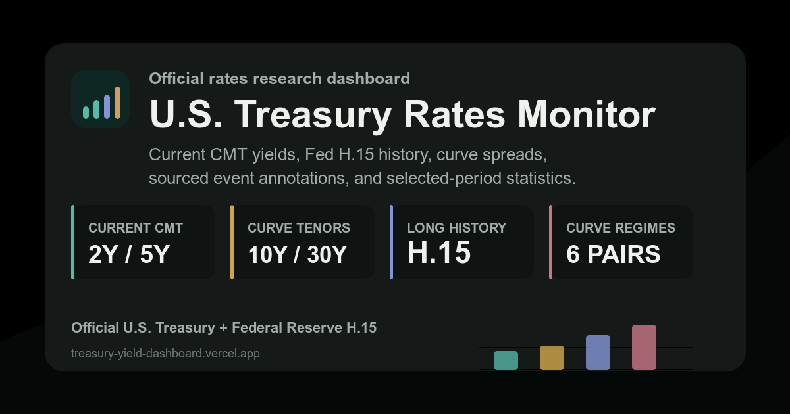

# U.S. Treasury Rates Monitor

An institutional research interface for official U.S. Treasury Constant Maturity rates, long-run curve analysis, and clearly separated delayed Treasury-futures proxies. The monitor covers current 2Y, 5Y, 10Y, and 30Y CMT yields, daily changes, six core spreads, date-to-date comparison, sourced event windows, historical regimes, and selected-period statistics.

Live deployment: <https://treasury-rates-monitor.vercel.app>



## Verification Status

| Area | Verification |
| --- | --- |
| Current rates | Direct U.S. Treasury XML; 2Y, 5Y, 10Y, and 30Y values and prior-observation changes recalculated by `verify:data` |
| Long-run history | Federal Reserve H.15 DDP package with Treasury XML latest-observation supplement |
| Curve analytics | Six spread identities, basis-point units, missing-value rules, and CSV units independently asserted |
| Regime analysis | Six directional classifications, neutral handling, and completed-calendar-period rules covered by deterministic tests |
| Futures proxies | Four-symbol allowlist, inverse price/yield interpretation, session normalization, and partial-feed handling asserted |
| Production | Vercel deployment from `main`; `/api/health`, security headers, HTTPS, metadata, sitemap, and social preview enabled |

Run the same release gate locally with `npm run verify`.

## Data Source

The backend reads the official U.S. Treasury XML feed for Daily Treasury Par Yield Curve Rates:

- Source page: <https://home.treasury.gov/resource-center/data-chart-center/interest-rates/TextView?type=daily_treasury_yield_curve>
- XML feed pattern: `https://home.treasury.gov/resource-center/data-chart-center/interest-rates/pages/xml?data=daily_treasury_yield_curve&field_tdr_date_value=YYYY`

No API key is required. The server fetches the current New York calendar year plus the prior year, normalizes the XML, computes daily changes against the previous Treasury observation, and caches the result for 10 minutes by default. The frontend refreshes automatically every 15 minutes while open.

Treasury CMTs are official daily par-yield observations, not transaction prices or intraday quotes. Treasury derives them from indicative bid-side quotations obtained by the Federal Reserve Bank of New York at or near 3:30 PM ET each trading day and usually publishes them by 6:00 PM ET, so no free official intraday CMT update exists. Faster polling would not make the underlying official curve fresher.

The separate Futures tab uses delayed Yahoo Finance market data for CBOT 2-Year Note (`ZT=F`), 5-Year Note (`ZF=F`), 10-Year Note (`ZN=F`), and Ultra U.S. Treasury Bond (`UB=F`) futures. Ultra Bond's 25Y+ deliverable basket is used only as a 30Y-sector proxy. These are traded prices, not CMT yields. The server tries an allowlisted multi-symbol spark request, per-symbol chart requests, a five-day latest-session recovery for empty one-day responses, and finally Yahoo quote-page data. Each contract is normalized to its own CME trade date; stale or mixed-date contracts are disclosed individually, and no change is shown without a verified comparison observation. Yahoo/yfinance is an unofficial convenience layer suitable for this educational market-reference view, not an authoritative or licensed professional feed. A commercial trading deployment should replace it with licensed CME data.

FRED was reviewed as a possible primary source because it is academically familiar and reliable. The app intentionally keeps Treasury as primary for current values because Treasury is the direct official publisher of the Daily Treasury Par Yield Curve Rates, while FRED republishes the relevant DGS series from the Federal Reserve/H.15 ecosystem and its official API requires an API key.

For long-run regime analysis, the app also uses the official Federal Reserve H.15 Data Download Program preformatted Treasury Constant Maturities CSV package:

- H.15 DDP page: <https://www.federalreserve.gov/datadownload/Choose.aspx?rel=H15>
- Direct CSV package: `https://www.federalreserve.gov/datadownload/Output.aspx?rel=H15&series=bf17364827e38702b42a58cf8eaa3f78&lastobs=&from=&to=&filetype=csv&label=include&layout=seriescolumn&type=package`

This gives reliable long-run daily history back to the earliest available H.15 observations, while Treasury XML supplements the newest current observation if Treasury has published a later record than H.15/FRED. See [DATA_SOURCE_DECISION.md](./DATA_SOURCE_DECISION.md) for the source comparison and freshness check.

## Research Features

- Long-run historical data for 2Y, 5Y, 10Y, and 30Y Treasury yields.
- Trader-style workspace tabs: Market, Futures, Compare, History, and Regimes. Only the active view is shown, avoiding a stacked-scroll layout.
- A delayed CBOT Treasury-futures tape for `ZT=F`, `ZF=F`, `ZN=F`, and `UB=F`, with per-contract trade date and freshness, verified session range, conditional prior-session comparisons in 32nds, quote timestamps, and explicit inverse price/yield direction. Incoherent provider snapshots are disclosed rather than presented as one live market state. Futures data is isolated from every official CMT calculation, spread, regime, statistic, and export.
- Validated shareable workspace URLs preserve the active view and relevant range, dates, spread, curve pair, history section, and weekly/monthly interval. The Copy view action writes the normalized setup URL to the clipboard; malformed or out-of-sample parameters fall back to valid H.15 dates and supported controls.
- Date-range presets: 1Y, 5Y, 10Y, 20Y, Max, plus custom start/end dates.
- Six core 2Y/5Y/10Y/30Y curve combinations: 5Y-2Y, 10Y-2Y, 30Y-2Y, 10Y-5Y, 30Y-5Y, and 30Y-10Y.
- Date-to-date yield curve comparison with custom as-of/reference dates and 1W, 1M, 1Y, and range-start shortcuts.
- Sourced macro event annotations with explicit window conventions and focus actions that apply the contextual window and return directly to the rates/spreads view. Markers do not claim causality.
- A weekly or monthly color-coded curve-regime ribbon for each of the six segments. Classifications are ex-post descriptions of non-overlapping completed calendar intervals, not contemporaneous signals. The six directional classifications are bull steepening, bear steepening, bull flattening, bear flattening, parallel shift higher, and parallel shift lower. Near-parallel uses a disclosed project-defined 3 bps weekly or 5 bps monthly slope tolerance. Exact-zero pair-average moves are neutral and excluded from the six directional counts; open periods remain unclassified.
- Selected-range CSV export containing dates, 2Y/5Y/10Y/30Y yields in percent per annum, and all six core curve spreads in basis points; every exported column declares its unit.
- Selected-period statistics: last valid observation and date, min, max, average, annualized daily-change volatility, 1M/3M/1Y changes, last-value empirical CDF, and valid observation count. Lookback changes use the nearest valid observation on or before the calendar target even when it predates the visible range.
- Light and dark themes for presentation use.

Historical charts use observed business-day data only. Weekends, market holidays, and source-level `ND` observations are not imputed. Treasury ceased publication of the 30Y CMT on February 18, 2002 and resumed it on February 9, 2006; the dashboard explicitly preserves February 18, 2002 through February 8, 2006 as unavailable rather than treating H.15's interim estimated values as observed 30Y quotations. Dependent 30Y spreads are consequently unavailable for that interval. A methodology marker identifies Treasury's December 6, 2021 shift from quasi-cubic Hermite to monotone-convex curve construction; both regimes remain official, but long-run comparisons should recognize the change.

## Quick Start

Prerequisites: Node.js 22 and npm.

```bash
npm ci
npm run dev
```

Open <http://localhost:5173>. Vite proxies `/api` requests to the Express backend on port `4174`.

## Production Run

```bash
npm run build
npm start
```

Open <http://localhost:4174>. In production, Express serves both `/api/yields` and the built frontend from `dist/`.

## Scripts

- `npm run dev`: start Vite and Express together.
- `npm run build`: type-check and create the production frontend bundle.
- `npm start`: run the production Express server.
- `npm run preview`: preview only the Vite build.
- `npm run verify:data`: fetch official sources and assert current values, history coverage, latest-source merge, and spread calculations.
- `npm run verify:futures`: verify the four-symbol allowlist, price-change calculations, inverse yield-direction semantics, range validation, and partial-feed behavior with deterministic fixtures.
- `npm run verify:futures:live`: additionally fetch the current delayed Yahoo futures data and validate all four contracts and their intraday bars.
- `npm run verify:research`: verify all six curve classifications, completed-period handling, selected-window statistics, and unit-explicit CSV output.
- `npm run verify`: run the production build plus research and official-data verification suites.

## Configuration

No environment variable is required. Copy `.env.example` only when you need to override a local default.

Optional environment variables:

- `PORT`: production/server port. Default: `4174`.
- `CACHE_TTL_MS`: backend Treasury data cache duration. Default: `600000`.
- `HISTORY_WINDOW_DAYS`: lookback window for historical charts. Default: `365`.
- `HISTORY_CACHE_TTL_MS`: long-run H.15 cache duration. Default: `1800000`.
- `FUTURES_CACHE_TTL_MS`: delayed Yahoo Treasury-futures cache duration. Default: `300000`.

None of these values is a credential. Do not commit `.env.local` or any provider token.

## API

`GET /api/yields`

Returns:

- `summary`: current 2Y, 5Y, 10Y, and 30Y yields plus prior observation, daily bps change, and daily percent change.
- `curve`: latest official curve points.
- `history`: one-year historical series for each dashboard maturity.
- `spreads`: all six current 2Y/5Y/10Y/30Y curve spreads with daily basis-point changes.
- `source`: Treasury source links, latest official record date, previous record date, raw feed-metadata timestamp, retrieval timestamp, SHA-256 source fingerprint, and transformation version. The interface displays retrieval time rather than presenting Atom metadata as a market observation time.
- `cache`: cache status (`hit`, `refresh`, or `stale`).

`GET /api/history`

Returns:

- `rows`: long-run H.15 daily Treasury constant maturity observations for 2Y, 5Y, 10Y, and 30Y, plus computed fields for all six pairwise curve spreads.
- `maturities`: maturity metadata used by the research charts.
- `spreads`: spread definitions.
- `availability`: first/last valid dates and observation counts by maturity.
- `source`: H.15 source metadata, Treasury supplement status, raw-source SHA-256 fingerprints, transformation version, and limitations note.
- `cache`: cache status.

`GET /api/futures?range=1D|5D|1M`

Returns:

- `instruments`: delayed front-contract prices for `ZT=F`, `ZF=F`, `ZN=F`, and `UB=F`, including nullable verified comparison, change in 32nds, session range, volume, quote time, CME trade date, per-contract freshness, inverse rate direction, and chart bars.
- `range`: the validated range and actual provider interval. One-day requests can recover each contract's latest available session from five-day data; mixed trade dates and insufficient comparison history are explicit warnings.
- `source`: Yahoo/CME attribution, delayed-reference status, retrieval time, and methodology links.
- `warnings`: partial-symbol or provider-fallback disclosures.
- `cache`: cache status.

`GET /api/health`

Returns `{ "ok": true, "service": "treasury-rates-monitor" }` when the deployed API runtime is reachable.

## Project Structure

```text
api/
  futures.js            Vercel delayed futures function
  health.js             Vercel health check
  history.js            Vercel H.15 history function
  yields.js             Vercel current Treasury function
public/
  404.html               Production not-found page
  favicon.svg            Browser icon
  og-rates-monitor.png   Social preview
  robots.txt             Search crawler policy
  sitemap.xml            Canonical production URL
scripts/
  verify-data.mjs        Official-source and calculation verification
  verify-futures.mjs     Futures normalization and live-feed checks
  verify-research.mjs    Regime, statistics, event, and CSV assertions
server/
  cache.js              In-memory cache
  config.js             Source URLs, maturity definitions, runtime config
  futuresClient.js      Yahoo delayed Treasury-futures fetch/fallback/validation logic
  historicalClient.js   Federal Reserve H.15 DDP CSV fetch/parse/normalize logic
  index.js              Express app, API routes, production static serving
  treasuryClient.js     Treasury XML fetch/parse/normalize logic
src/
  components/           Tabbed workspace, curve matrix, comparison, charts, and regime timeline
  hooks/                Official, historical, futures, and theme hooks
  lib/                  Formatting, event, range, and statistics utilities
  styles/               Theme tokens and responsive layout
  types.ts              Shared frontend data contracts
DATA_SOURCE_DECISION.md Source comparison, lineage, and intraday-data decision
vercel.json             Serverless functions, caching, and security headers
```

## Deployment

The production target is Vercel because the project uses a Vite frontend and colocated Node serverless API routes.

The production deployment includes:

- `api/health.js`
- `api/yields.js`
- `api/history.js`
- `api/futures.js`
- `vercel.json`
- `public/robots.txt`, `public/sitemap.xml`, and `public/404.html`

Security headers are configured in `vercel.json` for Vercel and through Helmet for the local Express production server. The app has no required secrets or API keys.

The Vercel project is connected to the GitHub `main` branch. A push to `main` creates a production deployment; other branches can be used for preview deployments. A manual production deployment is also available:

```bash
npx vercel --prod
```

Production URL:

```text
https://treasury-rates-monitor.vercel.app
```

You can also use any Node 22 host that can run an Express server.

Recommended settings for Render, Railway, Fly.io, or similar:

- Build command: `npm ci && npm run build`
- Start command: `npm start`
- Health check: `/api/health`
- Required secrets: none

For static-only hosts, keep the backend deployed separately and point the frontend to that API, or use a platform function to proxy Treasury XML requests. The included one-service Express setup is the simplest deployment path.

## Interpretation and Data Limitations

- CMT yields are official daily par-yield observations, not executable prices, intraday cash quotes, or bond total returns.
- The percentage shown beside a daily yield move is the percentage change in the yield level. Basis points are the primary fixed-income change unit.
- Historical charts retain observed business days only. Weekends, market holidays, source-level `ND` values, and the official 30Y publication gap are not imputed.
- Event markers provide sourced context and do not establish causality.
- Curve regimes are ex-post descriptions of completed periods, not forecasts or trading signals.
- Yahoo Finance futures prices are delayed, unofficial market references. They are never converted into CMT yields or included in official spreads, statistics, regimes, or exports.
- A trading or investment process requiring executable intraday cash Treasury data should use a licensed source such as CME BrokerTec rather than this public educational feed.

## Release Checklist

```bash
npm ci
npm run verify
npm run verify:futures:live
npm audit --omit=dev
```

Before publishing, confirm that the production health endpoint returns `200`, the latest official Treasury record date is current for the publication calendar, and the social preview uses `og-rates-monitor.png`.
